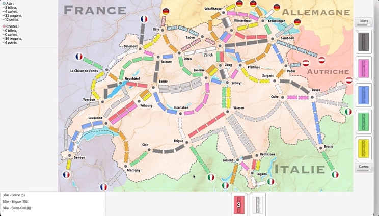

# tCHu-tCHu Game Enhancements

Welcome to the enhanced version of tCHu-tCHU, an exciting multiplayer game, inspired by Ticket to Ride board game. This README outlines the latest improvements and features from a player's perspective.

## Player Experience

- **Players and Bots**: Choose to play against two bots or with two other players.
- **Language Selection**: Select your preferred language at the game's start.
- **Game Control**: As the game initiator, you have control over various game events and options.

## Game Improvements

### Enhanced Gameplay
- **Three-Player Mode**: Now three players can enjoy tCHu together, with each claiming one part of a double road.
- **Gamer Tag Selection**: Choose your unique gamer tag at the beginning of the game through a special window featuring a train image.
- **Language and Rules Menu**: A comprehensive menu allows language selection and access to simplified game rules, divided into three categories:
  1. **Tickets**: Usage and purpose.
  2. **Card Drawing**: How-to guide.
  3. **Claiming Routes and Tunnels**: Detailed instructions.

### Scoring and Endgame Features
- **Ticket Points Visibility**: Players can now see the points each ticket awards, positive for completed tickets and negative otherwise.
- **Podium Display**: At game end, a podium displays player rankings based on points. For example, if Mohamed scores 107, Malak 102, and Ada 87, the podium will reflect these rankings.
- **Longest Route Highlight**: The game's longest route is now distinctively colored at the end.

## Java Implementation

- **Additional Player**: Adapted most classes to include a new player and updated RemotePlayerProxy in ServerMain.
- **Gamer Tag Implementation**: A new method in FirstGraphicalPlayer displays the gamer tag entry window.
- **Dynamic Menus**: Menu adaptation in BeforeGame class with Enum types for language-specific choices.
- **ObservableGameState Updates**: Adjusted to display points next to each ticket.
- **MapViewCreator Enhancement**: Altered for the longest route color change.
- **Podium Display Functionality**: Implemented in GraphicalPlayer using the showPodium method.

## Resources and Credits

- **Train PNG**: [Clipart Library](http://clipart-library.com/clipart/yckK8bkRi.htm)
- **Spain Flag Icon**: [ClipartMax](https://www.clipartmax.com/middle/m2H7G6N4i8b1d3N4_español-spain-flag-circle-png/)
- **French Flag Icon**: [PNG AAA](https://www.pngaaa.com/detail/790364)
- **UK Flag Icon**: [VHV](https://www.vhv.rs/viewpic/ihhoTwh_uk-flag-png-transparent-uk-flag-icon-png/)
- **Podium Image**: [Freepng](https://www.freepng.fr/png-zkfigy/)
